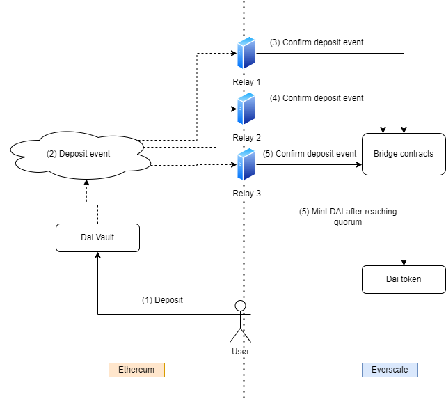
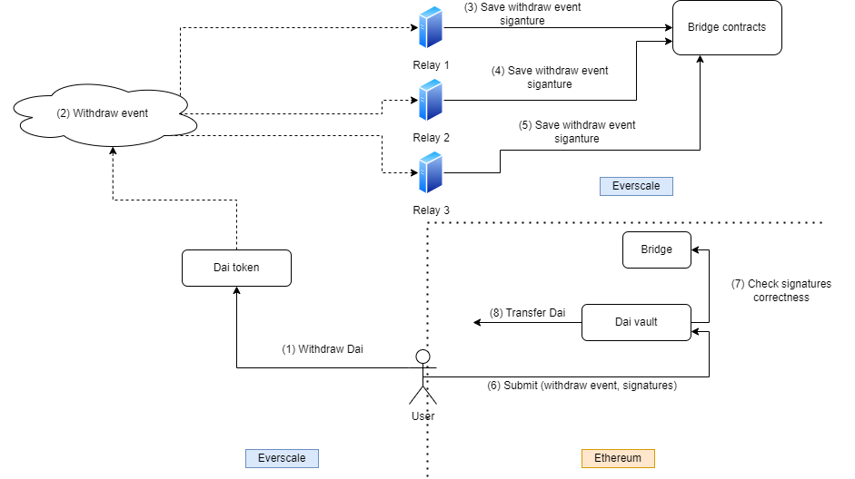
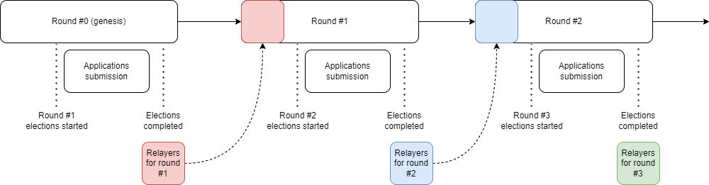
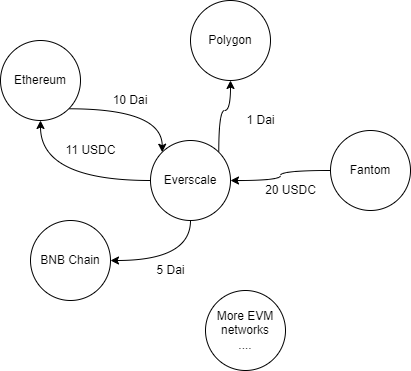
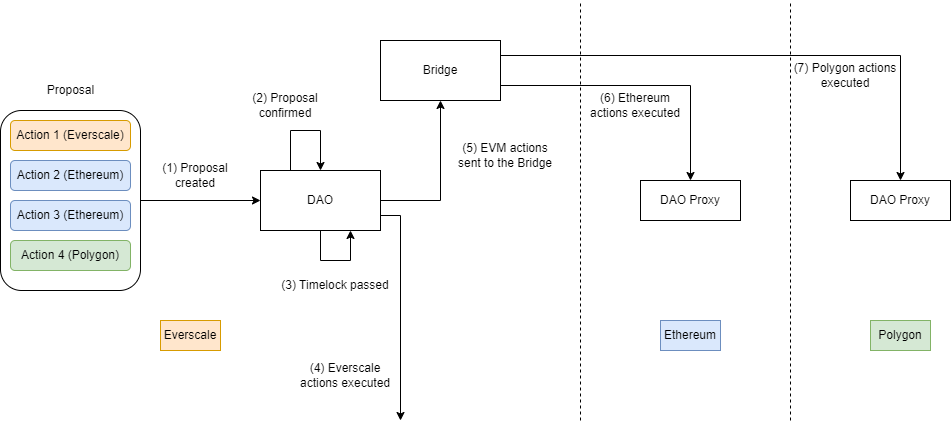
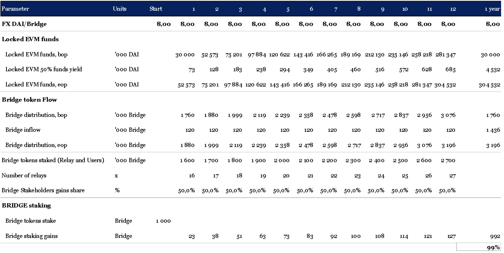
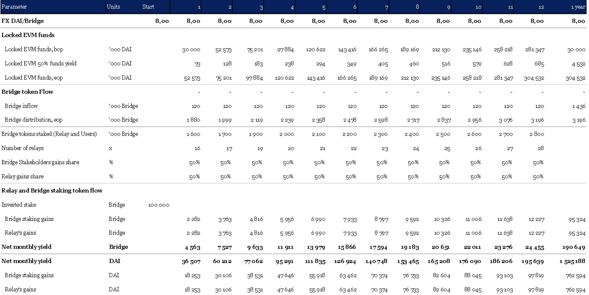
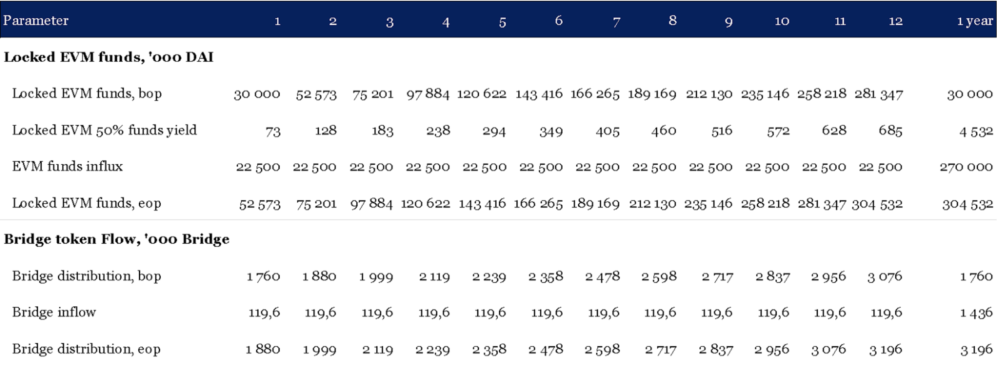

# Litepaper

## Abstract

This document is a simplified version of the White Paper for Octus Bridge V2.

The following describes both the basic functionality of the Bridge V2 and emerging features of this product, such as:

* Bridge\* token staking;
* Relayer auction, which allows stakeholders to become relayers;
* Connection of any EVM\*\*-compatible blockchains and most other chains supporting smart contracts;
* Liquidity management on the EVM side with subsequent buyback of Bridge tokens and their distribution among stakeholders;
* Bridge V2 management using DAO, with the possibility of creating cross-chain proposals.

This document is not technical and does not cover the actual implementation of the product, but instead gives an idea of the capabilities of Octus Bridge V2.


_\* The Bridge token is a token in the Everscale network, and the Bridge is a protocol that transfers events between EVM networks and Everscale_



_\*\* EVM stands for Ethereum Virtual Machine. Examples of EVM-compatible blockchains are Ethereum, Binance Smart Chain, Polygon, Fantom, xDai, and so on._


## Introduction

Octus Bridge V1 is a bridge between Ethereum and Everscale. First, the Bridge supports the transfer of tokens between Ethereum and Everscale. 20 Ethereum tokens are connected to Octus Bridge V1, including USDT, DAI, USDC, WBTC, WETH, WEVER, etc. The TVL for all tokens exceeds $40 million.


_Wrapped Everscale (WEVER) is an equivalent to the Wrapped Ether token, but for the native token of the Everscale network - EVER_


The first version of the Octus Bridge was significantly centralized - a group of three relayers confirmed events. We have intentionally limited the possibility of adding external relayers to minimize risks in the project's early days. All administrative functions were in the hands of a multi-signature wallet controlled by the [Broxus](https://broxus.com) team.

After six months of successful operation, we are launching a new, significantly expanded version - Octus Bridge V2.

## Technical overview

The basis for the V2 operation is:

* Set of smart contracts on the Everscale network;
* Set of smart contracts on each connected EVM network;
* A specialized software - relayer node. This software must be run by special actors - relayers. They keep the Bridge running, just as miners keep running the PoW networks.

Relayers' task is monitoring and confirming a set of events in EVM networks and Everscale.


The list of events is stored on-chain on the Everscale side. The DAO can add new events to this list and delete old ones.


For example, if a user deposits DAI into a particular smart contract (Vault) on the Ethereum side, each relayer sends a unique transaction to the Everscale network. This transaction confirms the fact of a deposit event on the Ethereum network. Once the quorum is reached, the DAI token is automatically minted on the Everscale side.

<figure><figcaption></figcaption></figure>

In the Everscale→EVM direction, the Bridge works similarly, with one exception. Due to potentially high network fees, relayers do not send transactions to the EVM networks. Instead, relayers must sign specific EVM-compatible payload with their key and put the signature in a particular contract in the Everscale network. Each connected EVM network has a special contract (Bridge), which stores the public keys of the relayers, so it's possible to verify that the actual relay makes the signature. Anyone can send a payload and a list of signatures to Vault, and if the signatures are correct, Vault will send tokens to the user's Ethereum address.

<figure><figcaption></figcaption></figure>

## V2 features

### Staking Bridge tokens

With the release of Octus Bridge V2, the project now has a governance token - Bridge. Any token holder can stake it in the Bridge, after which they will start receiving Bridge tokens. These Bridge tokens will come from selling tokens earned from liquidity management on the EVM side.

As an example of liquidity management on the EVM side, we consider staking 1,000 Bridge tokens over one year. With a monthly distribution of gains, the yield from staking can be up to 99% per annum at the current level of the Bridge token exchange rate (Appendix 1).

### Relayer auction

Any stakeholder who has staked over 100,000 Bridge tokens can become a relay. To do this, a stakeholder must start a relayer node and apply for the next election. The elections take place every round, and each round lasts one week. The DAO can change the duration of the round and the minimum stake size for becoming a relayer.

<figure><figcaption></figcaption></figure>

If the relayer behaves maliciously - for example, confirms incorrect events, or does not participate in events confirmation, DAO can slash the relay. In this case, the relay's stake and reward will be distributed among the current stakeholders.

The appendix considers a scenario for managing a relayer with 100,000 Bridge tokens steak over one year (Appendix 2).

### Connecting the EVM-compatible blockchain

The first version of the Bridge only worked between Ethereum and Everscale. Our new protocol allows connecting any EVM-compatible blockchains to the Everscale bridge V2 (such as Polygon, BNB Chain, Avalanche, Fantom, etc.).

<figure><figcaption></figcaption></figure>

The Number of blockchains that the Bridge can connect to is unlimited, and the DAO decides to connect a new network. Any EVM blockchains can interconnect without the need to develop any specialized bridges.

### Liquidity management on the EVM side

TVL of bridge V1 exceeded $30.5 Million. In the first version, when a user transferred the tokens from Ethereum to Everscale, their Ethereum tokens were locked in a special contract in Ethereum. The tokens could be withdrawn from this contract only if someone made a token withdrawal from the Everscale.

Everscale bridge V2 introduces a procedure for managing these funds. Tokens locked on the EVM network can be transferred to various yield farming protocols. The capital gains will be sent to the Everscale network through the Bridge, and from there, it will be converted to a Bridge token and distributed between stakeholders and relayers. For the first time, tokens will be distributed between stakeholders and relayers in the ratio of 50% and 50%. The DAO can change this ratio.

The appendix considers a scenario with x10 TVL growth over a year, starting with $30 million in liquidity on the EVM side. A 50% liquidity management at a 6% yield could yield $4.5 million to be distributed among the Bridge stackers and relayer managers (Appendix 3).

#### The use of Yearn Vaults V2

An essential feature of the V2 is the utilization of Yearn Vaults V2. Any token transfer from EVM to Everscale is now a deposit to the corresponding Everscale bridge Vault. Our contracts are fully compatible with Yearn's strategies. Therefore, locked tokens on the Ethereum side, and other connected EVM blockchains, can be easily handed over to yield farming strategies.

It is important to note that not all locked funds in Vaults will be distributed between strategies. It is essential to allow users to withdraw their liquidity from Everscale instantly. To accomplish this, DAO, in every Vault, specifies the share of funds, which will be distributed to the strategies.

#### Role model

The DAO makes all the decisions related to liquidity management. However, making decisions through the DAO takes a long time. Some decisions in Vault need to be made quickly - therefore, we implemented two additional roles with limited privileges. It is important to note that these roles do not have access to withdraw tokens from the Vault directly.

**Management**

This role is responsible for strategy performance and adjusting some Vault parameters. For example, management can change the fees on deposits and withdrawals from Vault.

**Guardian**

This role can promptly disable deposits and withdrawals from the Vault. Guardian can also shut down any connected strategy and withdraw funds from the strategy directly to the Vault.

### DAO

The new version of the Bridge introduces a DAO managed by Bridge token stakeholders. DAO makes all decisions related to the bridge configuration, relayer slashing, adding new tokens, adding new networks, managing locked liquidity, and so on. The Bridge V2 DAO is designed with the best practices of popular DeFi protocols such as Compound and AAVE in mind.

Any stakeholder with more than 100,000 Bridge tokens can create a DAO proposal. When a DAO proposal is created, a 48-hour review period is commenced. Following the review period, a 72-hour voting phase begins. At least 500,000 votes are required to have the proposal obtained. If the majority cast "yes," the proposal enters a 48-hour timelock phase. After that, the proposal can be executed.

#### Cross Chain Proposals

Although the creation of proposals and the voting for them takes place in the Everscale network, a user can indicate actions in any EVM-connected networks in the proposal. Moreover, one proposal can contain a set of actions in several networks at once - for example, in Everscale, Ethereum, and Avalanche. Since the DAO is integrated into the Bridge, the proposals can be transferred to any connected network. Thus, Everscale Bridge launches the first cross-chain DAO with the ability to manage any EVM-compliant networks at once.

<figure><figcaption></figcaption></figure>

### Arbitrary events support

As mentioned previously, the main function of Everscale bridge V1 is transferring tokens between Everscale and Ethereum. In the new version, we added support for arbitrary events. One can use Bridge V2 to build cross-chain Dapps of any variation. In layman's terms, the event configuration is as follows: `(network, target event) → (network, action).` For example, token transfer event configurations are as follows:

* `(Everscale, withdraw Dai to Ethereum) → (Ethereum, release Dai)`
* `(Ethereum, lock Dai) → (Everscale, mint Dai)`

Bridge V2 has no limitations on the types and Number of connected event configurations. For example, the target event could be an update of the Chainlink rate, and the action would be a swap on a decentralized exchange in the Everscale network. Adding a custom event occurs through a special DAO proposal and does not require updating the relayer node.

* (Everscale, withdraw Dai to Ethereum) -> (Ethereum, release Dai)
* (Ethereum, lock Dai) -> (Everscale, mint Dai)

Bridge V2 has no limitations on the types and Number of connected event configurations. For example, the target event could be an update of the Chainlink rate, and the action would be a swap on a decentralized exchange in the Everscale network. Adding a custom event configuration occurs through a special DAO proposal and does not require updating the relayer node.

## Appendix

### Legends and assumptions

| Term                                     | Legend                                                                          |
| ---------------------------------------- | ------------------------------------------------------------------------------- |
| '000                                     | Thousands of units                                                              |
| bop                                      | Beginning of period                                                             |
| eop                                      | end of period                                                                   |
| Locked EVM 50% funds yield               | 50% of Locked EVM fund allocated in different strategies with 6% ARP            |
| EVM funds influx                         | Linear growth of funds                                                          |
| Bridge distribution                      | Farming, Presale, Broxus, DeFi Alliance                                         |
| Bridge inflow                            | distribution of 10% of Bridge tokens                                            |
| Bridge tokens staked (relayer and Users) | Equal all relayers staked 100 000 each                                          |
| Number of relayers                       | Starting 16 presale relayers and adding one relayer each month                  |
| Bridge Stakeholders gains share          | 50% of Locked EVM 50% funds yield will be distributed among BRIDGE stakeholders |
| Bridge tokens stake                      | Initial stake                                                                   |
| Bridge staking gains                     | Gains per invested Bridge tokens                                                |
| Relayer gains share                      | 50% of Locked EVM 50% funds yield will be distributed among relayers            |
| Invested stake                           | Initial stake of 100 000 Bridge tokens and relayer activity                     |
| Relayers' gains                          | Gains for relayer activity                                                      |

### 1. Bridge tokens staking

<figure><figcaption></figcaption></figure>

### 2. Relayer Bridge staking

<figure><figcaption></figcaption></figure>

### 3. EVM liquidity management

<figure><figcaption></figcaption></figure>

## Disclaimer

This paper is for general information purposes only. It does not constitute investment advice, a recommendation, or a solicitation to buy or sell any investment. It should not be used to evaluate the merits of making any investment decision and should not be relied upon for accounting, legal, tax advice, or investment recommendations. This paper reflects the current opinions of the authors and is not made on behalf of Broxus or its affiliates and does not necessarily reflect the opinions of Broxus, its affiliates, or individuals associated with Broxus. The opinions reflected herein are subject to change without being updated.
